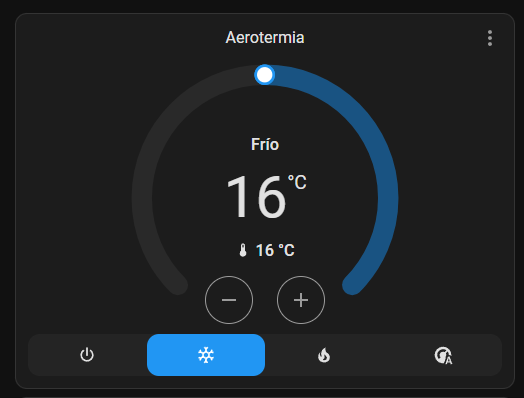

# Aerothermal Temperature Control

Tarjeta Lovelace personalizada para Home Assistant que controla una instalación de
**aerotermia con suelo radiante y depósito de inercia**:

- Termostato del **suelo radiante** (enciende/apaga la bomba de impulsión vía relé) con presets.
- Bloque del **motor LG** (objetivo de agua + temperatura de impulsión / inercia).
- **Modo único compartido** (off / frío / calor) que sincroniza el termostato y el motor.

La inteligencia (conmutación calor/frío, presets, seguridad) vive en el **servidor** (HA),
no en la tarjeta, así funciona aunque no haya ninguna pestaña abierta.



---

## Arquitectura

```
                 ┌───────────────────────────┐
                 │  Tarjeta Lovelace (esta)   │  solo UI: lee estados / llama servicios
                 └─────────────┬─────────────┘
                               │
   input_select.aerotermia_modo (off / calor / frio)   <- modo maestro
                               │
        ┌──────────────────────┴───────────────────────┐
        │ Automatización A: conmuta modo + sincroniza   │
        └───────┬───────────────────────┬──────────────┘
                │                        │
   climate.suelo_radiante_calor   climate.suelo_radiante_frio   (generic_thermostat)
        (ac_mode off)                 (ac_mode true)
                └───────────┬───────────┘
                            ▼
        switch.socket_garaje_aerotermia_bomba   (relé bomba de impulsión)
                            ▲
   sensor.temperatura_termostato  (sensor de la zona)

   climate.bomba_de_calor_aire_agua_2  (motor LG: objetivo agua + impulsión real)
```

Los dos `generic_thermostat` comparten relé y sensor; solo uno está activo a la vez
(el otro queda en `off`). El modo `auto` existe solo a nivel del motor LG, no en el suelo.

---

## Instalación

### 1. Backend (Home Assistant)

Copia el contenido de [`ha-config/configuration.yaml`](ha-config/configuration.yaml) a tu
`configuration.yaml` y el de [`ha-config/automations.yaml`](ha-config/automations.yaml) a tus
automatizaciones. Reinicia Home Assistant.

Verifica que existan: `climate.suelo_radiante_calor`, `climate.suelo_radiante_frio` e
`input_select.aerotermia_modo`.

### 2. La tarjeta

**Opción A — HACS (repositorio personalizado):**

1. HACS → ⋮ → *Repositorios personalizados*.
2. URL: `https://github.com/serweck/aerothermal-temperature-control` · Categoría: **Dashboard**.
3. Instálalo desde HACS. El recurso Lovelace se registra solo; recarga el navegador (Ctrl+F5).

**Opción B — Manual:**

1. Copia `dist/aerothermal-temperature-control.js` a `config/www/` de tu HA
   (p. ej. `config/www/aerothermal-temperature-control.js`).
2. Añádelo como recurso (Ajustes → Paneles → ⋮ → Recursos, o en YAML):

   ```yaml
   resources:
     - url: /local/aerothermal-temperature-control.js
       type: module
   ```
3. Recarga el navegador (Ctrl+F5).

### 3. Añadir la tarjeta a un dashboard

```yaml
type: custom:aerothermal-temperature-control
name: Aerotermia
mode_select: input_select.aerotermia_modo
thermostat_heat: climate.suelo_radiante_calor
thermostat_cool: climate.suelo_radiante_frio
water_climate: climate.bomba_de_calor_aire_agua_2
pump_switch: switch.socket_garaje_aerotermia_bomba
inertia_sensor: ""        # vacío -> usa current_temperature del LG
presets:
  - { label: Fuera,   preset: away }
  - { label: Confort, preset: comfort }
  - { label: Eco,     preset: eco }
  - { label: En Casa, preset: home }
  - { label: Dormir,  preset: sleep }
show_modes: [off, cool, heat]
```

También hay **editor visual** para los entity_id principales (presets y `show_modes` se editan en YAML).

---

## Opciones de configuración

| Opción | Req. | Descripción |
|--------|:---:|-------------|
| `mode_select` | ✅ | `input_select` del modo maestro (off/calor/frio). |
| `thermostat_heat` | ✅ | `generic_thermostat` de calor. |
| `thermostat_cool` | ✅ | `generic_thermostat` de frío. |
| `water_climate` | ✅ | Climate del motor LG. |
| `pump_switch` | — | Relé de la bomba (indicador). |
| `inertia_sensor` | — | Sensor de inercia; vacío usa `current_temperature` del LG. |
| `name` | — | Título de la tarjeta. |
| `presets` | — | Lista `{label, preset[, icon]}`. Por defecto Fuera/Confort/Eco/En Casa/Dormir. |
| `show_modes` | — | Subconjunto de `off`, `cool`, `heat`. |

---

## Desarrollo

```bash
npm install      # dependencias
npm run build    # genera dist/aerothermal-temperature-control.js
npm run watch    # recompila al guardar
npm run typecheck
```

Código en `src/` (LitElement + TypeScript). El editor visual está en `src/editor.ts`.

---

## Notas

- Los valores de los presets se configuran en el YAML de los `generic_thermostat` (sección
  `*_temp`) y cambiarlos requiere reiniciar HA. La tarjeta solo los **selecciona**.
- Suelo radiante en frío: vigila la **condensación** (la temperatura de impulsión del agua,
  que fija el LG, no debe bajar del punto de rocío).
- `min_cycle_duration: 10 min` protege la bomba de ciclos cortos.

## Licencia

MIT
